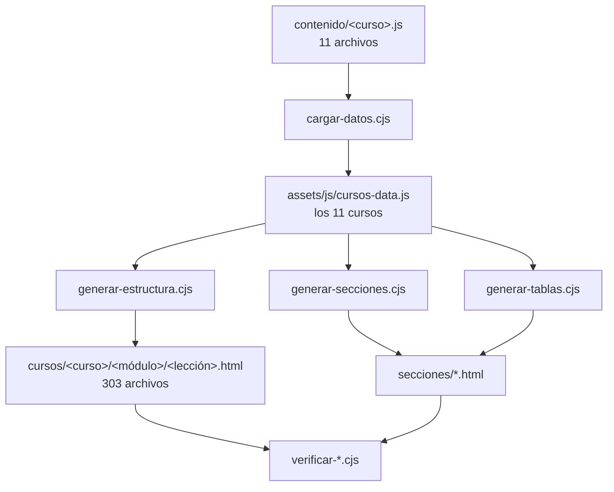

<p align="center">
  
</p>

<p align="center">
  <a href="https://apaza-victor.github.io/Aprende-Sin-Limites/"></a>
  <a href="index.html"></a>
  <a href="secciones/cursos.html"></a>
  <a href="secciones/tablas.html"></a>
  <a href="secciones/calculadora.html"></a>
  
  
</p>

<p align="center">
  <b>Sitio educativo estático en español</b> · sin compilación · sin framework · sin <code>package.json</code>
</p>

---

## Qué es

Material de refuerzo para cursos de preparación, en HTML, CSS y JavaScript
vanilla. Se abre el archivo y funciona: no hay compilación, ni empaquetado, ni
paso de instalación. Lo único externo son Bootstrap, sus iconos y la tipografía,
y todo entra por CDN.

| Métrica | Detalle |
| :--- | :--- |
| 📚 **11 cursos** | matemática, física, química, biología, historia, comunicación, razonamiento verbal y matemático, alfabetización digital, ciencias naturales y admisión universitaria |
| 🧩 **50 módulos** | de 3 a 5 lecciones cada uno |
| 📄 **242 lecciones** | todas con objetivo, teoría, ejemplo y consejo |
| 🖼️ **310 páginas** | HTML generadas a partir de las tres plantillas |
| 📊 **66 figuras** | SVG dibujadas a mano, sin imágenes de mapa de bits |
| 🔗 **6 965 enlaces** | revisados uno a uno en cada generación |
| 📐 **398 fórmulas** | dibujadas con SVG desde LaTeX, sin MathJax |
| 🧮 **1 calculadora** | científica, con historial y sin `eval()` |

## Ver el sitio

**Está publicado en
<https://apaza-victor.github.io/Aprende-Sin-Limites/>**, servido por GitHub
Pages directamente desde `main`: cada `git push` actualiza la web sin ningún
paso de compilación, porque el repositorio ya es el sitio.

En local tampoco hay que instalar nada. Basta con abrir `index.html`, o servirlo
por HTTP —recomendado, para que las rutas relativas se comporten como en
producción—:

```bash
python -m http.server 8000
```

Y abrir <http://localhost:8000>. Las dependencias del proyecto son cero.

## Los once cursos

| Curso | Enlace | Curso | Enlace |
|---|---|---|---|
| 🧮 Matemática | [`cursos/matematica/`](cursos/matematica/) | 🧬 Biología | [`cursos/biologia/`](cursos/biologia/) |
| ⚛️ Física | [`cursos/fisica/`](cursos/fisica/) | 🌍 Ciencia, tecnología y ambiente | [`cursos/ciencia-tecnologia-ambiente/`](cursos/ciencia-tecnologia-ambiente/) |
| ⚗️ Química | [`cursos/quimica/`](cursos/quimica/) | 📜 Historia | [`cursos/historia/`](cursos/historia/) |
| ✍️ Comunicación | [`cursos/comunicacion/`](cursos/comunicacion/) | 🧠 Razonamiento verbal | [`cursos/razonamiento-verbal/`](cursos/razonamiento-verbal/) |
| ➗ Razonamiento matemático | [`cursos/razonamiento-matematico/`](cursos/razonamiento-matematico/) | 💻 Alfabetización digital | [`cursos/alfabetizacion-digital/`](cursos/alfabetizacion-digital/) |
| 🎓 Admisión universitaria | [`cursos/admision-universitaria/`](cursos/admision-universitaria/) | | |

## Secciones

| Sección | Qué hay |
|---|---|
| [`cursos.html`](secciones/cursos.html) | Los once cursos y su índice de lecciones |
| [`metodo.html`](secciones/metodo.html) | Cómo estudiar cada bloque |
| [`tablas.html`](secciones/tablas.html) | Tabla de fórmulas, constantes y unidades del SI |
| [`calculadora.html`](secciones/calculadora.html) | Calculadora científica con historial |
| [`recursos.html`](secciones/recursos.html) | Simuladores y bancos de preguntas externos |
| [`faq.html`](secciones/faq.html) | Preguntas frecuentes |

## Cómo está construido

El contenido se escribe **una sola vez**, en `contenido/`, y de ahí sale todo lo
demás. El HTML de `cursos/` y `secciones/` es un resultado generado: se puede
tocar para una prueba rápida, pero cualquier cambio se pierde al volver a
generar.



<details>
<summary><b>Estructura de carpetas</b></summary>

```
.
├── index.html                  Portada
├── assets/
│   ├── css/estilos.css         Tokens de color, tema y componentes
│   ├── js/                     Comportamiento del sitio y datos
│   └── img/figuras/            66 figuras SVG
├── contenido/                  Contenido profundo, un archivo por curso
├── cursos/                     HTML generado: cursos, módulos y lecciones
├── plantillas/                 Las tres plantillas de las que se genera
├── secciones/                  HTML generado: las seis secciones
├── herramientas/               Generadores y verificadores (Node.js)
└── docs/banner.svg             Cabecera de este README
```

</details>

### Decisiones que no son obvias

**Sin framework.** Un sitio de 310 páginas estáticas no necesita React ni un
bundler. Cargar Bootstrap por CDN y escribir el resto a mano deja el proyecto
legible entero y sin `node_modules`.

**Colores por variables, no dos temas.** `assets/css/estilos.css` define el tema
oscuro en `:root` y el claro en `:root[data-tema="claro"]`. El tema claro son 37
líneas de variables redefinidas más 13 de acentos por curso, no una segunda
hoja de estilos: añadir un color nuevo se hace en un sitio y los dos temas lo
heredan.

**El tema no parpadea.** Un `<script>` de seis líneas en el `<head>` lee
`localStorage` y fija `data-tema` en `<html>` antes de que se pinte el fondo. Si
no hay elección guardada, sigue a `prefers-color-scheme`. `assets/js/ui.js` es
quien después dibuja el botón de cambio.

**La calculadora no usa `eval()`.** `assets/js/calculadora.js` trae su propio
tokenizador y su propio intérprete de expresiones, porque meter texto del
usuario en `eval()` o en `new Function()` es entregarle el navegador a
cualquiera que abra la página. Entiende `2^10`, `5!`, `200 + 10%`, `sin(30)`,
`2pi`, `(1+2)(3+4)`, logaritmos y factoriales, avisa de los errores en
castellano y funciona en grados o radianes.

**LaTeX dibujado a mano.** `generar-estructura.cjs` convierte cada fórmula en
SVG. MathJax o KaTeX habrían cargado cientos de kilobytes para mostrar 398
fórmulas que se pueden renderizar en 3 KB de código propio, y además quedarían
ilegibles sin JavaScript.

**Nada se publica sin pasar los cinco verificadores.** No es burocracia: cada
uno existe porque ya encontró algo. El de enlaces ha detectado rutas rotas en
secciones que se habían regenerado a medias; el de fórmulas, un comando LaTeX
que el generador no sabía dibujar y que salía crudo en la página.

## Herramientas

Todo vive en `herramientas/` y se ejecuta con Node.js. Sin dependencias: no hay
`package.json` ni `node_modules`.

### Generar el sitio

```bash
node herramientas/cargar-datos.cjs           # contenido/ -> cursos-data.js
node herramientas/generar-estructura.cjs     # cursos, módulos y lecciones
node herramientas/generar-secciones.cjs      # secciones que salen del index
node herramientas/generar-tablas.cjs         # tabla de fórmulas
node herramientas/generar-calculadora.cjs    # página de la calculadora
```

Los cinco, en ese orden. Son **idempotentes**: ejecutarlos dos veces seguidas
produce archivos byte a byte idénticos.

### Verificar que nada se rompió

```bash
node herramientas/verificar-sintaxis.cjs     # todos los scripts compilan
node herramientas/verificar-enlaces.cjs      # ningún href relativo roto
node herramientas/verificar-marcas.cjs       # las fórmulas están bien formadas
node herramientas/verificar-figuras.cjs      # las figuras existen y son válidas
node herramientas/verificar-contenido.cjs    # sin texto corrupto ni lecciones vacías
```

Los cinco tienen que salir en verde antes de publicar. Para depurar una lección
concreta sin revalidar todo el sitio:

```bash
node herramientas/verificar-marcas.cjs contenido/matematica.js
```

### Despliegue

La web está en GitHub Pages, servida desde la rama `main` en su raíz:

<https://apaza-victor.github.io/Aprende-Sin-Limites/>

No hay workflow, ni carpeta de compilación, ni nada que configurar: como el
repositorio ya **es** el sitio, cada `git push` publica. El orden importa,
porque lo que se sube es el resultado de los generadores, no la fuente:

```bash
node herramientas/cargar-datos.cjs        # 1. fusionar contenido/
node herramientas/generar-estructura.cjs  # 2. cursos, módulos y lecciones
node herramientas/generar-secciones.cjs   # 3. secciones
node herramientas/generar-tablas.cjs      # 4. tabla de fórmulas
node herramientas/generar-calculadora.cjs # 5. calculadora
git add -A && git commit -m "..." && git push
```

Si solo se tocan `assets/`, `plantillas/` o el CSS, basta con el `push`.

Un detalle que condiciona todo lo demás: **todas las rutas del sitio son
relativas**, ninguna empieza por `/`. Por eso funciona igual en local, en un
servidor propio y dentro del subdirectorio `github.io/Repositorio/`. Si alguna
vez se escribe una ruta absoluta, la web se rompe en producción pero sigue
funcionando al abrir el archivo.

## Licencia

Material educativo de uso libre. Si reúses el contenido o el código, cítalo
como tal.

---

<p align="center">
  Hecho con HTML, CSS y JavaScript, sin dependencias que instalar.
</p>
